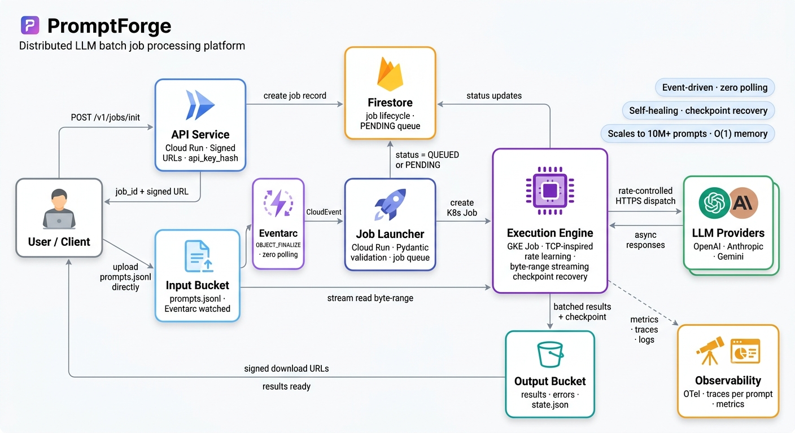

<p align="center">
  
</p>

<h1 align="center">PromptForge</h1>

<p align="center">
  <strong>Distributed LLM batch job processing — at any scale.</strong><br/>
  Submit a file of prompts. Get every result back. Reliably.
</p>

<p align="center">
  
  
  
  
  
  
</p>

---

## The Problem

Running thousands of prompts against an LLM provider is not just an API call problem. It is a systems problem.

Providers impose rate limits. Requests fail. Pods crash. Files are too large to hold in memory. You need to know exactly which prompts succeeded, which failed, and why — at a per-prompt level. And you need all of that without babysitting the process.

Most teams build fragile scripts that break at scale, or pay for expensive managed pipelines that offer no visibility. PromptForge is neither.

---

## What It Does

You upload a JSONL file of prompts. PromptForge processes every prompt against your chosen LLM provider — respecting rate limits, surviving failures, checkpointing state — and returns all results via signed download URLs.

That's the contract. Everything underneath is what makes it work at scale.

---

## Features

| Capability | What it means |
|---|---|
| **Dynamic rate learning** | No manual RPM/TPM tuning. Uses TCP-inspired slow-start and congestion avoidance to discover real provider limits at runtime. |
| **Memory-constant streaming** | Prompts are read line-by-line from GCS via byte-range streams. A 10M-prompt job uses the same pod memory as a 100-prompt job. |
| **Checkpointed recovery** | Execution state is persisted to GCS every 30 seconds. Pod crashes are transparent — Kubernetes restarts the pod and it resumes from the last checkpoint. |
| **Prompt-level observability** | Every dispatch is a traced span with token counts, latency, retry history, and error codes. Rate learning state is emitted as real-time gauges. |
| **Batched storage writes** | Results buffer in memory and flush in batches. 1M prompts produce ~2,000 GCS writes, not 1 million. |
| **Reconciliation on completion** | A bitset pass across all result and error files detects any silently lost prompts. Every dropped ID is logged by name to the OTel stack. |
| **Isolated per-job execution** | One GKE pod per job. No shared execution state between clients. A failure in one job cannot affect another. |
| **Sequential job queuing** | Multiple jobs from the same client run one at a time. No prompt collision, no resource contention. Queue management is automatic. |

---

## Architecture

PromptForge is organized into three layers:

### Ingestion
A **Cloud Run API** accepts job requests and returns a signed GCS upload URL. The client writes the prompt file directly to storage — no proxy, no bottleneck.

### Orchestration
An **Eventarc-triggered Cloud Run Job Launcher** catches the `OBJECT_FINALIZE` event when the upload completes. It stream-validates every line, updates job state in Firestore, and creates a dedicated Kubernetes Job. It exits as soon as the pod is scheduled.

### Execution
A **GKE Execution Pod** runs for the lifetime of a single job. It runs four concurrent async loops:

```
Dispatch Loop        — spaces requests by learned effective RPM
Response Handler     — processes LLM responses as they return, out of order
Result Buffer        — accumulates responses and flushes to GCS in batches
Checkpoint Writer    — persists offset + rate state every 30 seconds
```

The pod calls the LLM provider directly over HTTPS. No intermediate queue, no worker fleet. The async loop is the scheduler.

### End-to-end flow

```
POST /v1/jobs/init
        ↓
Cloud Run API  →  Firestore (job record)  →  returns signed GCS URL
        ↓
Client uploads prompts.jsonl to GCS
        ↓
GCS OBJECT_FINALIZE  →  Eventarc  →  Cloud Run Job Launcher
        ↓
Job Launcher validates file, creates GKE Job, exits
        ↓
Execution Pod: streams prompts → dispatches to LLM → buffers results → checkpoints state
        ↓
Results written to GCS in JSONL part files
        ↓
GET /v1/jobs/{job_id}/results  →  signed download URLs
```

The system is fully event-driven. Nothing polls.

---

## API Reference

**Base URL:** `https://api.promptforge.io/v1`
**Auth:** `X-API-Key: {api_key}` on every request. The raw key is never stored — only its SHA-256 hash.

### Submit a job

```http
POST /v1/jobs/init
```

```json
{
  "provider": "openai | gemini | anthropic",
  "model": "gpt-4o",
  "rpm": 500,
  "tpm": 100000,
  "max_retries": 3,
  "api_key": "sk-..."
}
```

**Response `202 Accepted`:**

```json
{
  "job_id": "uuid",
  "upload_url": "https://signed-gcs-url",
  "expires_at": "ISO8601"
}
```

Upload your JSONL file directly to `upload_url` using `HTTP PUT`.

---

### Check job status

```http
GET /v1/jobs/{job_id}
```

```json
{
  "job_id": "uuid",
  "status": "queued | running | completed | failed | cancelled",
  "total": 1000,
  "completed": 530,
  "failed": 20,
  "pending": 450,
  "progress_pct": 55.0,
  "created_at": "ISO8601",
  "estimated_completion": "ISO8601"
}
```

---

### Get results

```http
GET /v1/jobs/{job_id}/results
```

Available once `status = completed`.

```json
{
  "job_id": "uuid",
  "result_urls": ["https://signed-gcs-url", "..."],
  "error_urls":  ["https://signed-gcs-url"],
  "expires_at":  "ISO8601"
}
```

Each URL points to a JSONL part file. Merge all parts to reconstruct the full result set.

---

### Cancel a job

```http
DELETE /v1/jobs/{job_id}
```

Pending prompts are abandoned. In-flight prompts complete naturally.

---

## Prompt File Format

Upload a newline-delimited JSON file (`prompts.jsonl`):

```jsonl
{"prompt_id": 1, "prompt": "Summarise this document: ..."}
{"prompt_id": 2, "prompt": "Translate to French: ..."}
{"prompt_id": 3, "prompt": "Extract key entities from: ..."}
```

`prompt_id` must be a unique integer. It is used for deduplication, retry tracking, and reconciliation. Invalid lines are written to `errors.jsonl` — the job is never aborted due to malformed input.

---

## Result File Format

**`results_part_NNN.jsonl`** — one record per successful prompt:

```json
{
  "prompt_id": 1,
  "response": "...",
  "prompt_tokens": 200,
  "completion_tokens": 600,
  "total_tokens": 800
}
```

**`errors.jsonl`** — one record per permanently failed prompt:

```json
{
  "prompt_id": 47,
  "prompt": "...",
  "attempts": 3,
  "last_error_code": 429,
  "last_error_message": "Rate limit exceeded",
  "failed_at": "ISO8601"
}
```

---

## Rate Learning

PromptForge does not trust the RPM/TPM values you provide as exact limits. It treats them as upper bounds and discovers real provider limits through two phases:

**Slow Start** — Before any 429, the dispatcher multiplies its RPM target by 1.5 every 30 seconds:

```
10 → 15 → 22 → 33 → 49 → 73 → 110 → 165 → ...
```

**Congestion Avoidance** — After the first 429, it backs off (`rpm_target × 0.75`), waits 60 seconds, then increments by 1 per 30 seconds:

```
375 → 376 → 377 → 378 → ...
```

This mirrors TCP congestion control. The system finds the provider's real ceiling without prior knowledge and without manual configuration.

**Effective RPM** accounts for both request rate and token budget:

```
effective_rpm = min(rpm_target, tpm_limit / p95_output_tokens)
```

`p95_output_tokens` is a rolling P95 estimate updated after every successful response. If responses grow longer, throughput automatically decreases to respect the TPM ceiling.

---

## Observability

PromptForge uses **OpenTelemetry** across all components. The export target is configurable — point it at GCP native (Cloud Trace / Logging / Monitoring) or a self-hosted Grafana stack (Tempo / Loki / Mimir) without changing any application code.

Every prompt dispatch produces a child span:

```
Trace: job_123
  ├── span: job.init
  ├── span: job.launch       (file validated, pod created)
  ├── span: job.execute
  │     ├── span: prompt.dispatch  [prompt_id=1, attempt=1]
  │     │     attrs: latency_ms, prompt_tokens, completion_tokens, status
  │     ├── span: prompt.dispatch  [prompt_id=47, attempt=2, error_code=429]
  │     ├── span: buffer.flush     [batch=001, response_count=500]
  │     └── span: checkpoint.write [offset=125000, rpm_target=375]
  └── span: job.complete
```

Key metrics emitted in real time:

| Metric | Type | Description |
|---|---|---|
| `promptforge.rate.rpm_target` | Gauge | Current learned RPM target |
| `promptforge.rate.effective_rpm` | Gauge | RPM after TPM constraint |
| `promptforge.rate.p95_tokens` | Gauge | Rolling P95 token estimate |
| `promptforge.rate.429_events` | Counter | Rate limit events |
| `promptforge.prompts.completed` | Counter | Successfully processed |
| `promptforge.prompts.failed` | Counter | Permanently failed |
| `promptforge.llm.latency_ms` | Histogram | Provider call duration |
| `promptforge.queue.retry_depth` | Gauge | Prompts awaiting retry |

---

## Technology Stack

| Layer | Technology |
|---|---|
| API | Cloud Run (Python) |
| Job Launcher | Cloud Run (Python, ephemeral) |
| Execution Engine | GKE — one pod per job |
| Event routing | Eventarc (GCS → Cloud Run) |
| Job state | Firestore |
| Object storage | Google Cloud Storage |
| Secrets | GCP Secret Manager |
| Observability | OpenTelemetry → Grafana (Tempo / Loki / Mimir) or GCP native |
| LLM providers | OpenAI, Anthropic, Gemini |

---

## Design Principles

**Event-driven end to end.** No component polls. Every state transition is triggered by an event — HTTP response, GCS object finalize, async task completion.

**One pod, one job.** Each job runs in a fully isolated GKE pod. Failures are contained. Accounting is exact.

**Memory-constant.** Prompt files are never loaded in full. One line at a time, regardless of file size.

**At-least-once over at-most-once.** On recovery, prompts near the checkpoint boundary may be re-sent. This is a deliberate trade-off — duplicate work is preferable to silent data loss.

**No per-response writes.** Results accumulate in a buffer and flush in batches. 1M prompts produce ~2,000 GCS writes.

**Reconciliation as a first-class operation.** Job completion includes a bitset pass that verifies every `prompt_id` was accounted for. Lost prompts are surfaced explicitly, not silently ignored.

---

## Project Structure

```
.
├── docs/
│   ├── spec.md                          # API and data specification
│   ├── high-level-architecture.md       # Plain-language system overview
│   ├── architecture/
│   │   ├── complete-architecture.md     # Full phase-by-phase design
│   │   └── diagrams/
│   │       └── Architecture.png         # System architecture diagram
│   └── decisions/                       # Architecture decision records
│       ├── task-granularity-for-llm-processing.md
│       ├── cost-optimisations.md
│       └── rpm-tpm-learning.md
```

---

## Contributing

Contributions are welcome. Please open an issue before submitting a pull request for anything beyond a small fix — it helps align on direction before work begins.

1. Fork the repository
2. Create a feature branch (`git checkout -b feat/your-feature`)
3. Commit with clear messages
4. Open a pull request against `main`

---

## License

MIT License. See [LICENSE](LICENSE) for details.

---

<p align="center">
  <em>Built for failure, scale, and visibility — from day one.</em>
</p>
